# Bank Management System

<p align="center">
  Welcome to the Bank Management System, a simple console-based application written in C. This program provides basic banking functionalities such as creating accounts, depositing and withdrawing funds, checking balances, managing customer information, and handling loans.
</p>

## Introduction

The Bank Management System is a C program designed to simulate essential banking operations. It offers features like creating new accounts, performing balance/account inquiries, depositing and withdrawing funds, closing accounts, and managing bank loans.

## Features

- Create a new bank account
- Deposit funds into an account
- Withdraw funds from an account
- Check account balance
- View and manage customer information
- Perform loan-related transactions

## Getting Started

To run the Bank Management System locally, follow these steps:

1. **Clone the repository:**
    ```bash
    git clone https://github.com/soul-xettri/Bank-Management-System.git
    cd Bank-Management-System
    ```

2. **Compile the program:**
    ```bash
    gcc bank_management_system.c -o bank_management_system
    ```

3. **Run the executable:**
    ```bash
    ./bank_management_system
    ```

4. **Follow the on-screen instructions to interact with the Bank Management System.**

## Banking Operations

The Bank Management System includes the following operations:

- **Create Account:** Open a new bank account by providing necessary details.
- **Deposit Funds:** Add funds to your account.
- **Withdraw Funds:** Remove funds from your account.
- **Check Balance:** View the current balance of your account.
- **View Customer Information:** Display details of all customers.
- **Perform Loan Transactions:** Access loan-related functionalities.

## Contributing

Contributions are welcome! If you have suggestions for improvement or find any issues, feel free to submit a pull request or open an issue.

## License

This project is licensed under the MIT License.

Happy banking with the Bank Management System! 💰🏦

## Screenshots

### 1) Login Page

<p align="center">
  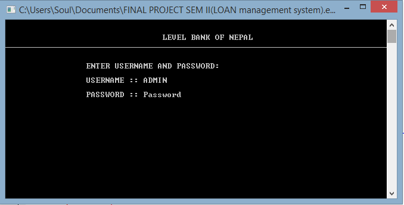
  <br />
</p>

### 2) Menu Page

<p align="center">
  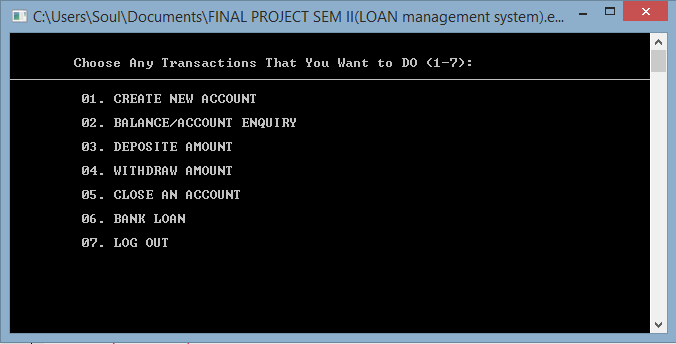
  <br />
</p>

### 3) Create Bank Account

<p align="center">
  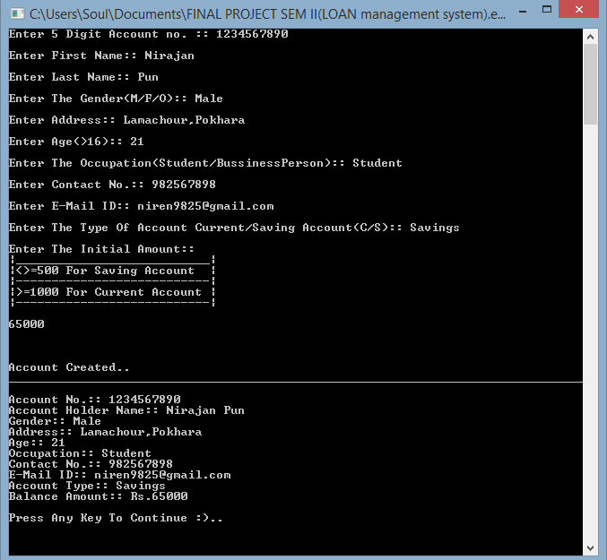
  <br />
</p>

### 4) Invoice for New Account

<p align="center">
  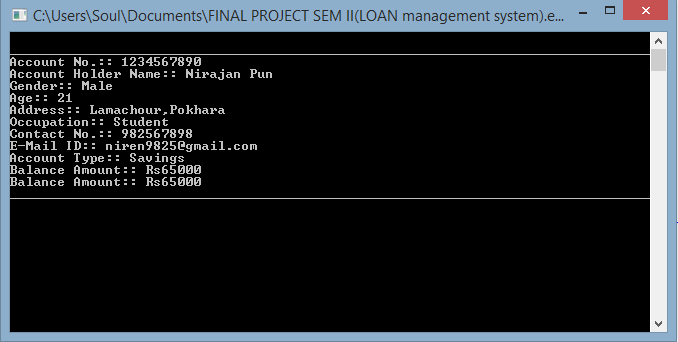
  <br />
</p>

### 5) Deposit Money

<p align="center">
  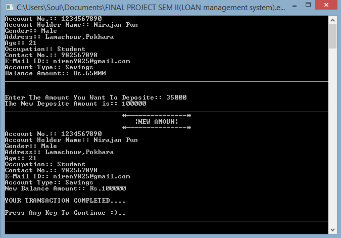
  <br />
</p>

### 6) Withdraw Money

<p align="center">
  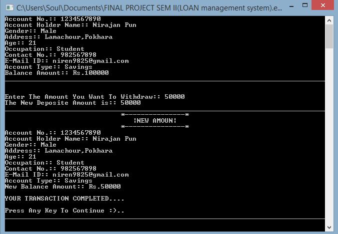
  <br />
</p>

### 7) Delete Account

<p align="center">
  
  <br />
</p>

### 8) Transaction Types

<p align="center">
  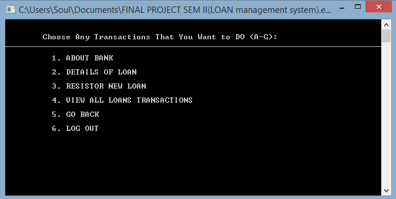
  <br />
</p>

### 9) Bank Loan Agreements

<p align="center">
  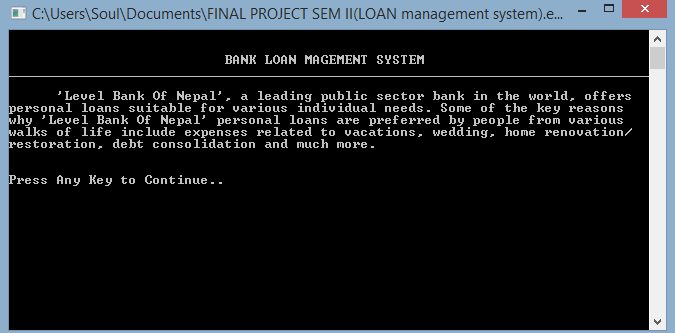
  <br />
</p>

### 10) Loan Details

<p align="center">
  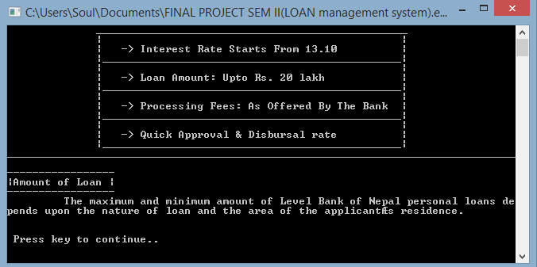
  <br />
</p>

### 11) Types Loans

<p align="center">
  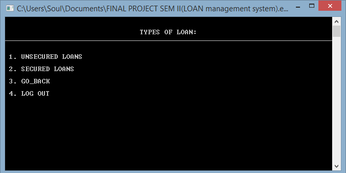
  <br />
</p>

### 12) Unsecure Loan

<p align="center">
  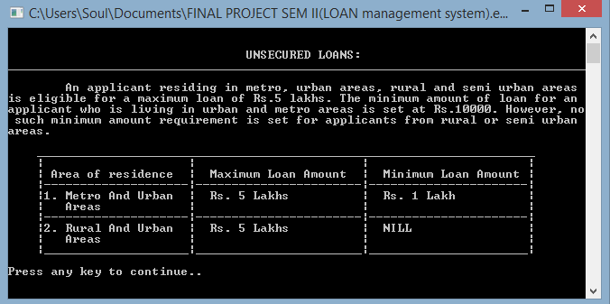
  <br />
</p>

### 13) Secure Loan

<p align="center">
  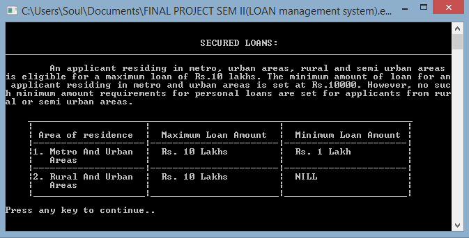
  <br />
</p>

### 14) Bill Generating

<p align="center">
  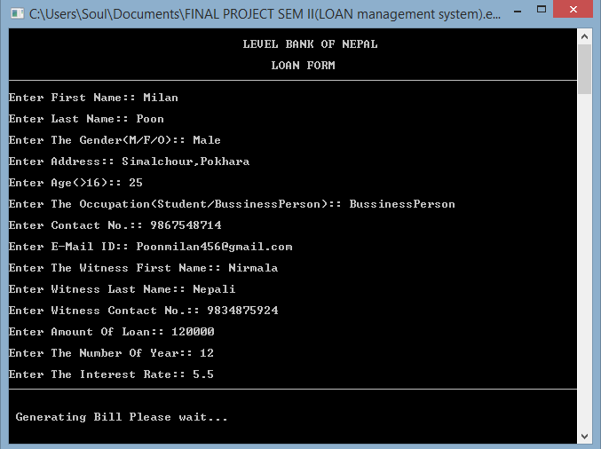
  <br />
</p>

### 15) Bill

<p align="center">
  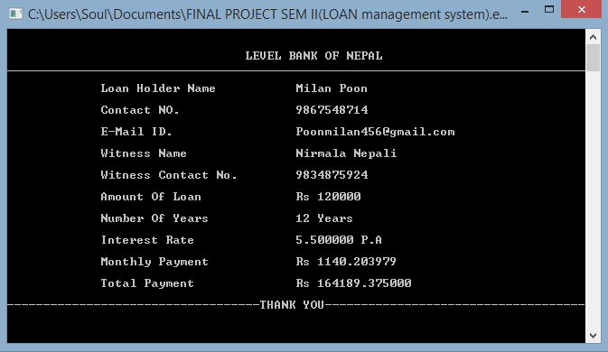
  <br />
</p>

### 16) Bank Loan Inovice

<p align="center">
  
  <br />
</p>
